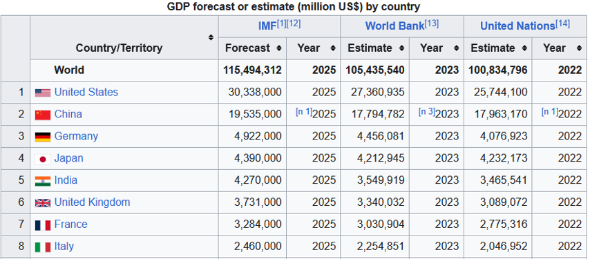

# Countries GDP Scraper

Target webpage: [List of countries by GDP (nominal)](https://en.wikipedia.org/wiki/List_of_countries_by_GDP_(nominal))
## Overview

This Scrapy project extracts GDP data for various countries and stores it in an SQLite database. The scraper processes country names, GDP values, and the corresponding years, ensuring data integrity and removing duplicates before saving the information.


Target Data: 



### Tools & Technologies Used

- **Python**: The primary programming language.
- **Scrapy**: For handling web scraping tasks.
- **SQLite**: A lightweight, serverless, self-contained SQL database engine.

## Example Usage:

Using main_gdp.py:

    first configure the  if __name__ == "__main__": section of the main_gdp.py script
    then cd: \Web-Scraping-Projects\countries_gdp>

```bash
python main_main.py
```

## Components

### 1. `items.py`
This module defines the `CountryGdpItem` class, which specifies the structure of the scraped data. It processes:
- `country_name`: Extracted and cleaned using `remove_tags` and `strip()`.
- `year`: Extracted using regex to find four-digit years and converted to integers if possible.
- `gdp`: Cleaned by removing commas and converting to a float.

### 2. `pipelines.py`
This module contains three data processing pipelines:
- CountriesGdpPipeline
- RemoveDuplicatesPipeline
- SaveToDatabasePipeline


### 3. `spiders/gdp.py`
- This is the main spider responsible for scraping GDP data from Wikipedia.
- The spider extracts:`country_name`, `year` and`gdp`.
- The extracted data is passed to `CountryGdpItem`, processed through the `pipeline.py`, and stored in the database.
- The spider uses CSS selectors to parse the HTML table containing GDP data. An alternative XPath-based method is also included as a comment.

## Output
- The extracted GDP data is stored in `countries_gdp.db` in the following format:

  | country_name | year | gdp |
  |-------------|------|------|
  | USA         | 2025 | 30338000 |
  | China       | 2025 | 19535000 |
  | Germany     | 2025 | 492200  |

