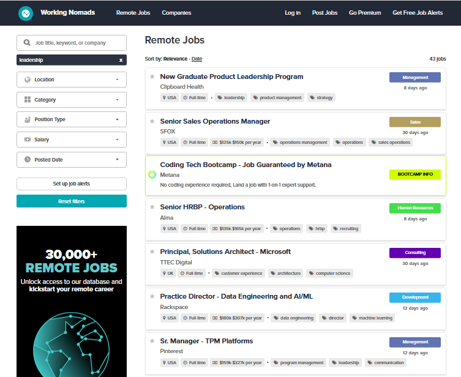
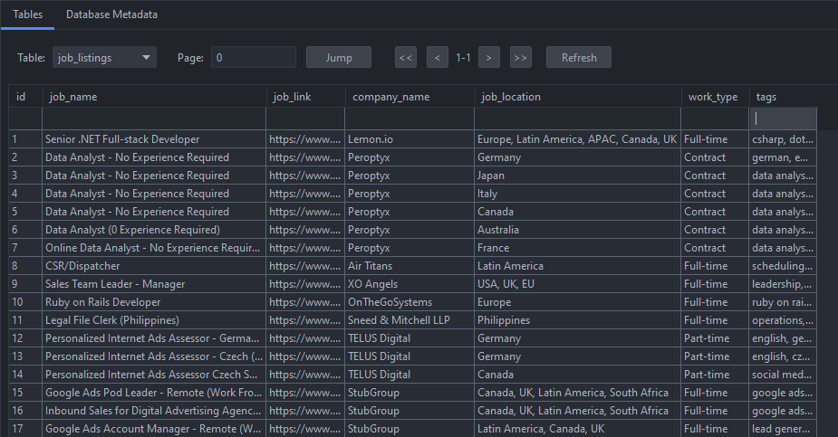

# Job Site Scraper

## Overview

This project is a web scraper designed to extract remote job listings from [WorkingNomads.com](https://www.workingnomads.com/jobs). It gathers key job-related details such as:

- Job title
- Company name
- Job location
- Work type (e.g., full-time, part-time)
- Job link
- Associated tags (e.g., skills, categories)

The extracted data is structured and can be stored in a database or exported in CSV or JSON format for further analysis.

### Screenshot




## Technologies Used

- **Python**: Core programming language for the scraper.
- **Scrapy**: Web scraping framework for data extraction.
- **Playwright**: Handles JavaScript-rendered content for dynamic scraping.
- **Item Loaders**: Cleans and processes extracted data.
- **SQLite** (Optional): Stores job listings in a local database.
- **CSV & JSON**: Enables easy data export for analysis.

## How It Works

### Scraper (`get_jobs.py`)

The scraper uses **Scrapy** and **Playwright** to interact with the **Working Nomads** website, dynamically loading job listings and extracting relevant information.

- The number of job listings to scrape is configurable via the `n_listings` parameter (default: 200).
- **Playwright** enables handling of JavaScript content, ensuring all jobs are fully loaded before extraction.
- Extracted data is processed using Scrapy's **Item Loaders** for cleaning and structuring.
- Data can be stored in:
  - **CSV file** (`jobs.csv`)
  - **JSON file** (`jobs.json`)
  - **SQLite database** (`jobs.db`, optional)

### Example Usage:

Using main_jobs.py:
- first configure the ``` if __name__ == "__main__":``` section of the main_jobs.py script 
- then cd: \Web-Scraping-Projects\job_site> 

```bash
python main_jobs.py
```
OR

- open a teminal 
- cd: \Web-Scraping-Projects\job_site> 

```bash
scrapy crawl get_jobs -a n_listings=201
```

## Output

Depending on the chosen format, the scraped job listings will be saved in:

- `jobs.csv` (CSV format)
- `jobs.json` (JSON format)
- `jobs.db` (SQLite database, if enabled)
 

---
