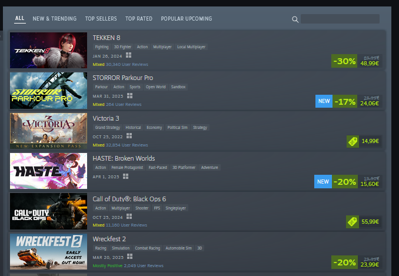

# Steam Specials Scraper

## Overview

This project is a web scraper designed to extract game deal listings from [Steam Specials](https://store.steampowered.com/specials). It gathers key game-related details such as:

- Game title
- Tags (e.g., Action, RPG)
- Release date
- Review score
- Review count
- Original price
- Sale price
- Discount percentage
- Currency
- Thumbnail image URL

The extracted data is structured and saved as a CSV file for further analysis.

### Screenshot



### Tools & Technologies

- **Python** for scripting and data processing
- **Playwright** for browser automation
- **Selectolax** for fast HTML parsing
- **Pandas** for structuring and exporting data
- **Logging** module for debugging and error handling

## How It Works

1. **Fetching Data:** The script launches a headless browser using Playwright to navigate the Steam Specials page.
2. **Parsing HTML:** Selectolax is used to extract relevant game details using CSS selectors.
3. **Processing Data:** Extracted data is cleaned and formatted into a structured form.
4. **Exporting Data:** The processed game listings are saved as a CSV file for analysis.

## Usage

Run the scraper with:
```sh
python main.py
```

The extracted data will be saved in the `outputs/` directory with a timestamped filename.

## Example Output

| Title               | Tags     | Release Date | Review Score | Review Count | Original Price | Sale Price | Discount |
|---------------------|---------|--------------|--------------|--------------|---------------|------------|----------|
| Cyberpunk 2077     | RPG     | 2020-12-10   | Overwhelmingly Positive | 50000 | 59.99 | 29.99 | -50% |
| The Witcher 3      | Action  | 2015-05-18   | Very Positive | 300000 | 39.99 | 9.99  | -75% |


## Known Issues

- The scraper may break if Steam updates its website structure. Updating CSS selectors in `tools.py` can fix this.
- Playwright requires a Chromium installation. Ensure `playwright install` is executed before running the script.
