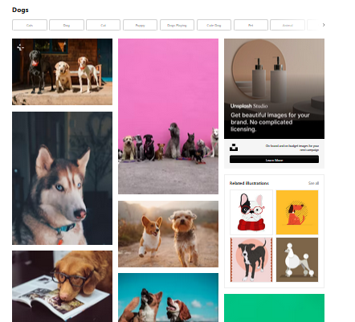

# Unsplash Scraper

## Overview
Scrapes website: [Unsplash.com](https://unsplash.com/)

Target Data example: Dogs entered as a search term on the web site:




This project provides two different methods to scrape images from Unsplash based on search terms and download them.

Both methods organize downloaded images into separate folders based on search terms.

### Tools & Technologies Used

- **Python**: The primary programming language for both scrapers.
- **Playwright**: For headless browser interaction, used in HTML scraping.
- **Selectolax**: A fast HTML parser for extracting image URLs.
- **HTTPX**: A library for making HTTP requests to download images.
- **Logging**: For real-time tracking of scraper progress and error handling.

## Usage

### API-Based Scraper (`scrape_unsplash_with_api.py`)

The API-based scraper interacts directly with the Unsplash API to fetch high-quality image URLs and download them efficiently. 
- The number of images to download per search term is set by the user.

### HTML-Based Scraper (`scrape_unsplash_with_html.py`)

The HTML-based scraper parses Unsplash website structure and extracts image URLs from the search results page. since this method relies on the current HTML structure of Unsplash, it may break if Unsplash updates its webpage layout.

- The number of images to download is set by the websites first loading page.

### Run the script(s):
- first configure the ``` if __name__ == "__main__":``` section of the script then:
```bash
python scrape_unsplash_with_api.py "or" python scrape_unsplash_with_html.py
```

### Example usage in Python:


```python
from scrape_unsplash_with_api import scrape_unsplash_using_api
scrape_unsplash_using_api(["nature", "sunset"], result=30)

"OR"

from scrape_unsplash_with_html import scrape_up_splash
scrape_up_splash(["mountains", "forests"])
```

## Output

Downloaded images are stored in:

```
unsplash/outputs/<search_term>/ 
```
